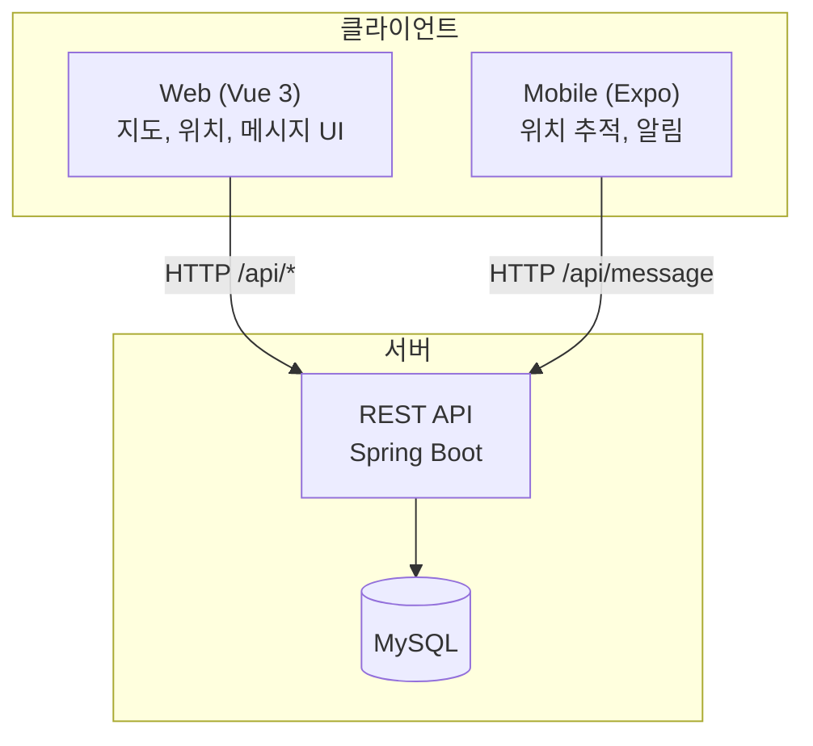
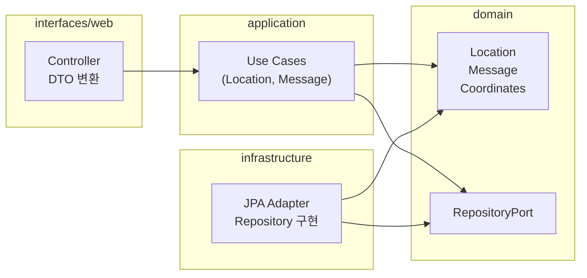
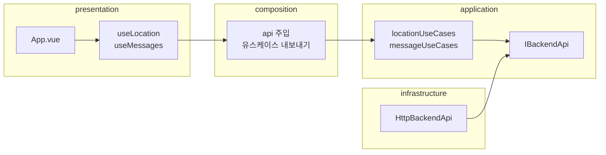
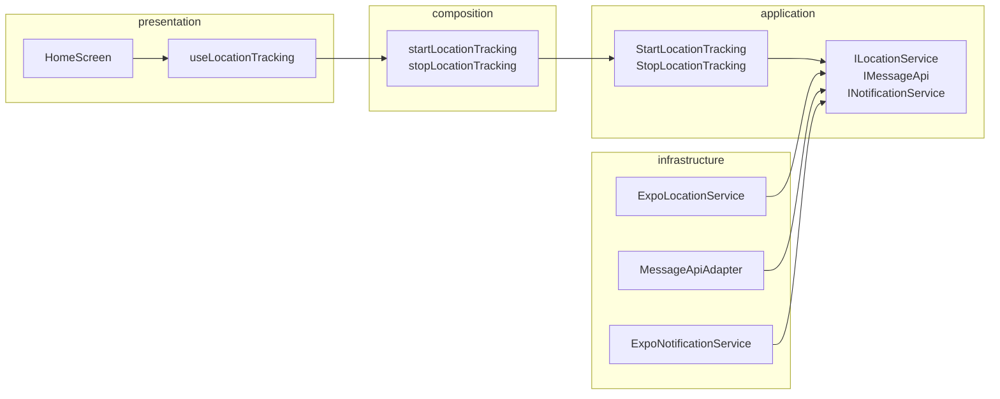
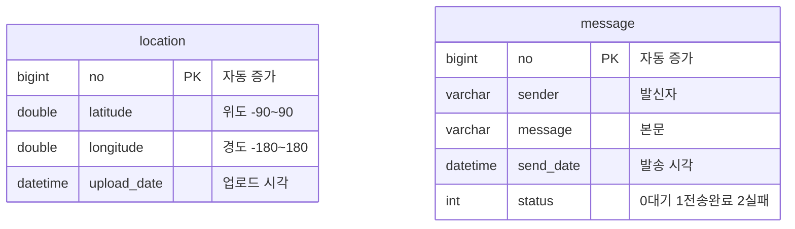

# Location Sample Project

위치 기반 메시지 및 위치 추적을 위한 풀스택 샘플 프로젝트입니다.  
**Backend**(Kotlin/Spring Boot), **Web**(Vue 3/Vite), **Mobile**(Expo/React Native) 세 부분으로 구성되며, 도메인·애플리케이션·인프라를 분리한 구조로 설계되어 있습니다.

---

## 1. 기능 및 사용 방법

### 1.1 Backend API (위치·메시지 서버)

| 기능 | HTTP | 사용 방법 |
|------|------|-----------|
| 내 위치 조회 | `GET /api/mylocation` | 최신 저장 위치 1건. 없으면 204. |
| 위치 목록 | `GET /api/locations?limit=100` | 최근 위치 목록(limit 1~500). 지도 마커용. |
| 위치 전송 + 미읽음 메시지 | `POST /api/message` | Body: `{ "latitude", "longitude" }`. 위치 저장 후 미읽음 메시지 배열 반환. |
| 메시지 목록 | `GET /api/messages?page=1&pageSize=10` | 페이징 목록. |
| 메시지 발송 | `POST /api/messages` | Body: `{ "sender", "message" }`. |

**실행:** `location-app/backend`에서 `./gradlew bootRun`. JDK 17, MySQL 필요. 스키마는 `schema.sql` 실행 후 사용.

---

### 1.2 Web (Vue 3 + Vite)

| 기능 | 사용 방법 |
|------|-----------|
| 최신 위치 불러오기 | "최신 위치 불러오기" 버튼 → `GET /api/mylocation` 후 화면에 표시. |
| 위치 갱신 | "위치 갱신" 버튼 → 브라우저 Geolocation으로 위·경도 획득 → `POST /api/message` 전송 → 미읽음 메시지 반영. |
| 지도 마커 | `GET /api/locations`로 목록 조회 후 카카오맵에 마커 표시. 마커 클릭 시 오버레이(갱신 시각, 좌표). |
| 지도 새로고침 | "지도 마커 새로고침" 버튼으로 목록 재조회. |
| 메시지 목록 | 이전/다음 버튼으로 페이징. |
| 메시지 보내기 | 작성자·내용 입력 후 전송. 성공 시 폼 초기화·첫 페이지 재조회. |

**실행:** `location-app/frontend`에서 `pnpm install` → `pnpm dev`. `.env`에 `VITE_API_BASE_URL`, `VITE_KAKAO_MAP_KEY` 설정(선택). 기본 포트 5173.

---

### 1.3 Mobile (Expo / React Native)

| 기능 | 사용 방법 |
|------|-----------|
| 위치 추적 시작 | "위치 추적 서비스 시작" 버튼 → 위치 권한 요청 → 약 60초 간격으로 GPS 수집 → 좌표를 `POST /api/message`로 전송 → 수신 메시지를 로컬 알림으로 표시. |
| 위치 추적 종료 | "위치 추적 서비스 종료" 버튼 → 구독 해제. |
| 상태 표시 | 대기(idle), 시작 중(starting), 추적 중(active), 종료 중(stopping), 오류(error)를 화면에 반영. |

**실행:** `location-mobile`에서 `pnpm install` → `pnpm start`. `.env`에 `EXPO_PUBLIC_API_BASE_URL` 설정(에뮬레이터: Android `http://10.0.2.2:8080`, iOS `http://localhost:8080`).

---

## 2. 각 프로젝트 패키지 구조

### 2.1 Backend (`location-app/backend`)

패키지 베이스: `com.example.location`

```
backend/
├── src/main/kotlin/.../
│   ├── domain/                    # 도메인
│   │   ├── location/              # Coordinates, Location, LocationRepositoryPort
│   │   └── message/               # Message, MessageStatus, MessageRepositoryPort
│   ├── application/               # 유스케이스
│   │   ├── location/              # GetCurrentLocation, GetLocations, UpdateLocation
│   │   └── message/               # GetMessagesPaginated, GetUnreadMessages, SendMessage
│   ├── infrastructure/persistence/# JPA 엔티티, *JpaRepository, *RepositoryAdapter
│   ├── interfaces/web/            # LocationController, MessageController, DTO, GlobalExceptionHandler
│   └── config/                    # WebConfig (CORS)
└── src/main/resources/
    ├── application.yml
    └── schema.sql
```

- **의존성:** `interfaces` → `application` → `domain` / `infrastructure` → `domain`.

---

### 2.2 Frontend (`location-app/frontend`)

`@/` → `src/`

```
frontend/
├── src/
│   ├── domain/           # types.ts (LocationResponse, MessageItem, MessagesPageResponse 등)
│   ├── application/
│   │   ├── ports/        # IBackendApi
│   │   └── use-cases/    # locationUseCases, messageUseCases
│   ├── infrastructure/api/  # HttpBackendApi (fetch, VITE_API_BASE_URL)
│   ├── composition/      # index.ts (api 주입, 유스케이스 내보내기)
│   └── presentation/     # hooks (useLocation, useMessages), utils (format)
├── App.vue
├── main.ts
└── vite.config.ts
```

- **의존성:** `presentation` → `composition` → `application` + `infrastructure`; use-cases는 ports + domain만 사용.

---

### 2.3 Mobile (`location-mobile`)

`@domain`, `@application`, `@infrastructure`, `@presentation` path alias

```
location-mobile/
├── App.tsx
└── src/
    ├── domain/
    │   ├── value-objects/   # Coordinates
    │   └── entities/        # Message, Messages
    ├── application/
    │   ├── ports/            # ILocationService, IMessageApi, INotificationService
    │   ├── use-cases/        # StartLocationTracking, StopLocationTracking
    │   └── composition/      # useCases.ts (포트 구현체 주입)
    ├── infrastructure/
    │   ├── location/         # ExpoLocationService
    │   ├── http/             # MessageApiAdapter
    │   └── notifications/     # ExpoNotificationService
    └── presentation/         # useLocationTracking, HomeScreen
```

- **의존성:** UI → 훅 → 유스케이스 → 포트 ← 인프라(Expo, fetch).

---

## 3. 아키텍처 구조 (UML)

### 3.1 시스템 구성



- Backend가 단일 API 서버이고, Web·Mobile이 동일 API를 소비합니다.

---

### 3.2 Backend 레이어 (클린 아키텍처)



- Controller는 유스케이스만 호출하고, 유스케이스는 도메인·포트만 사용. 영속성은 인프라에서 포트 구현.

---

### 3.3 Frontend 레이어



- UI는 훅만 사용하고, 훅은 composition을 통해 유스케이스 호출. HTTP는 포트 구현으로 한 곳에 모음.

---

### 3.4 Mobile 레이어



- 화면·훅은 조립된 유스케이스만 호출. 위치·API·알림은 각각 포트로 추상화되고 인프라에서 구현.

---

## 4. ERD 구조

위치·메시지는 서로 FK로 묶이지 않고, API 단에서만 함께 다뤄집니다.



- **location:** 디바이스/클라이언트가 올린 위치 이력. 최근순 조회·지도 마커용. `upload_date` DESC 인덱스.
- **message:** 발신자·본문·발송 시각·상태. 페이징·미읽음 조회용. `send_date` DESC, `status` 인덱스.
- 대규모 접속 가정으로 PK·인덱스는 BIGINT·InnoDB·조회 패턴 기준으로 설계.

---

## 5. 만들게 된 이유와 설계 이유

### 5.1 왜 만들었는지

- **위치 기반 메시지**를 한 번에 다루는 풀스택 예제가 필요했고, 웹(지도·목록·폼)과 모바일(실기기 위치 추적·알림)을 같은 API로 동작시키고 싶었습니다.
- Backend 하나로 위치·메시지 도메인을 제공하고, Web은 지도·메시지 조회/발송, Mobile은 주기적 위치 전송과 수신 메시지 알림에 집중하도록 했습니다.

### 5.2 왜 이렇게 작성했는지

- **Backend를 먼저 두고 API를 단일 진실 소스로 둔 이유**  
  웹과 모바일이 동일한 엔드포인트·요청/응답 형식을 쓰면, 스펙이 한 곳에서 정해지고 클라이언트는 그 계약만 따르면 됩니다. 도메인(Location, Message)과 검증·에러 형식(예: ErrorBody)을 서버에서 일원화했고, DB 스키마도 서버 리포지토리에서 버전 관리합니다.

- **도메인·유스케이스·인프라를 나눈 이유**  
  비즈니스 규칙(좌표 범위, 위치 덮어쓰기, 미읽음 처리 등)은 도메인·유스케이스에 두고, HTTP·JPA·expo-location·알림은 인프라(또는 포트 구현)에만 두었습니다. 그러면 테스트 시 포트를 목으로 바꾸기 쉽고, DB/프레임워크를 바꿀 때 도메인을 건드리지 않고 인프라만 교체할 수 있습니다.

- **프론트/모바일에서도 포트·유스케이스를 둔 이유**  
  API 호출을 “IBackendApi 호출”로 추상화해 두면, 실제 구현은 fetch든 axios든 환경 변수 기반이든 한 곳에서만 바꾸면 됩니다. 모바일은 위치·API·알림을 각각 포트로 두어, 플랫폼(Expo)이나 백엔드 변경 시 유스케이스·화면 로직을 최소한으로만 수정하게 했습니다.

- **ERD가 location / message 두 테이블로 단순한 이유**  
  현재 요구사항에서는 “특정 위치에 딸린 메시지”가 아니라 “위치 전송 시점에 서버가 반환하는 미읽음 메시지 목록”이면 충분합니다. 그래서 테이블 간 FK 없이 독립 엔티티로 두고, 조합은 API 레이어(유스케이스)에서 처리했습니다. 나중에 “위치별 메시지” 같은 연관이 필요해지면 그때 FK·스키마를 확장하는 편이 변경 범위를 줄입니다.

- **문서·한글 메시지**  
  로그·예외·UI 문구를 한국어로 통일해, 실행·연동·디버깅 시 한 곳에서 일관되게 읽을 수 있게 했습니다.

---

## 문서·실행 상세

| 항목 | 경로 |
|------|------|
| 전체 연동·실행 방법 | [docs/README.md](docs/README.md) |
| Backend 상세 | [docs/location-app/backend/README.md](docs/location-app/backend/README.md) |
| Frontend 상세 | [docs/location-app/frontend/README.md](docs/location-app/frontend/README.md) |
| Mobile 상세 | [docs/location-mobile/README.md](docs/location-mobile/README.md) |

이 README는 기능·사용 방법, 패키지 구조, 아키텍처(UML), ERD, 설계 이유를 한곳에서 보기 위한 요약입니다.
