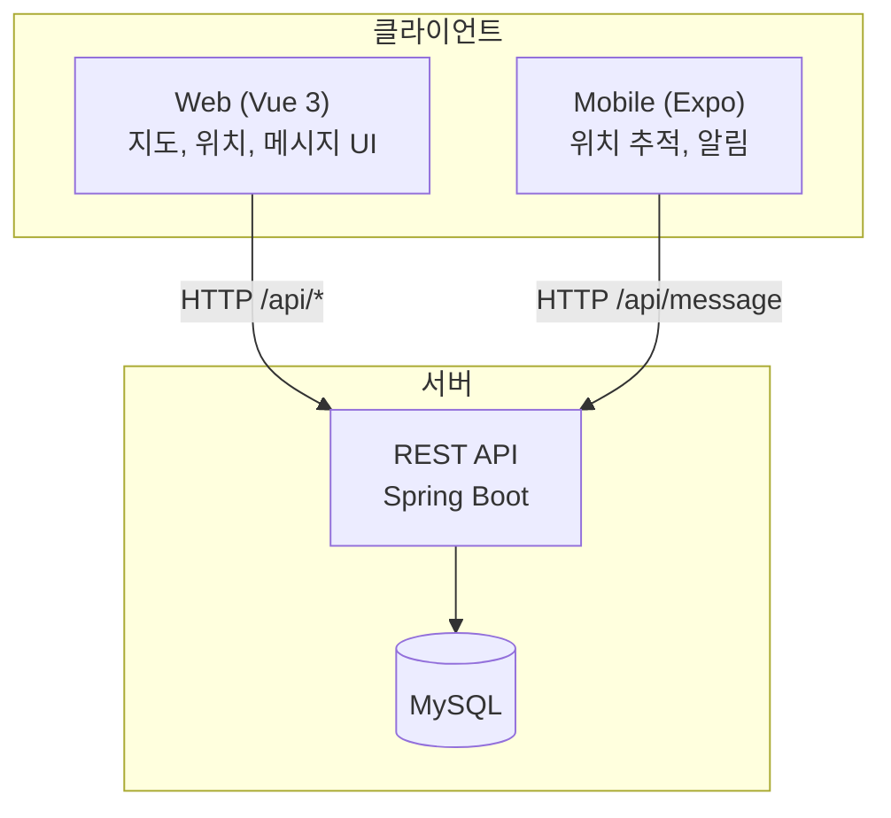
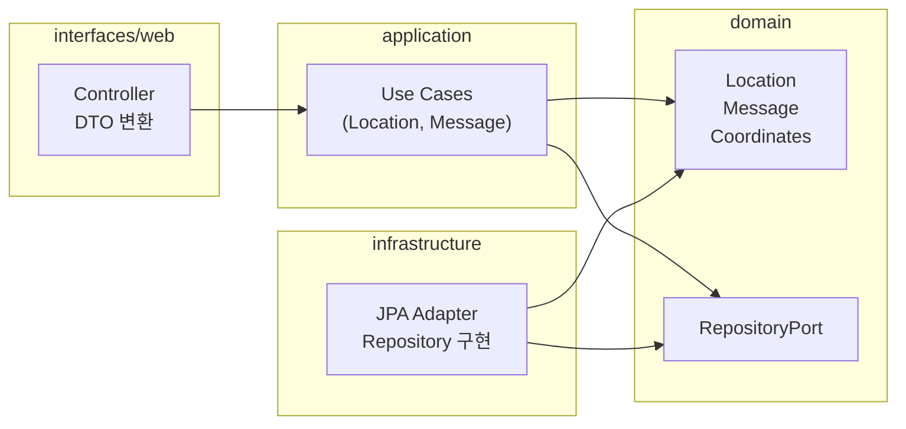
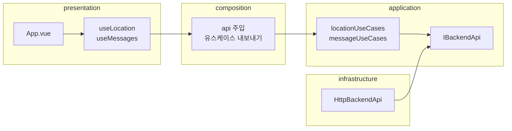
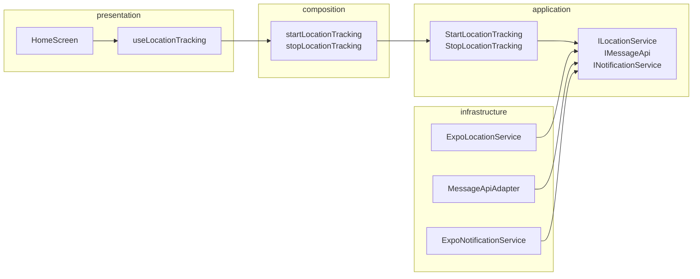
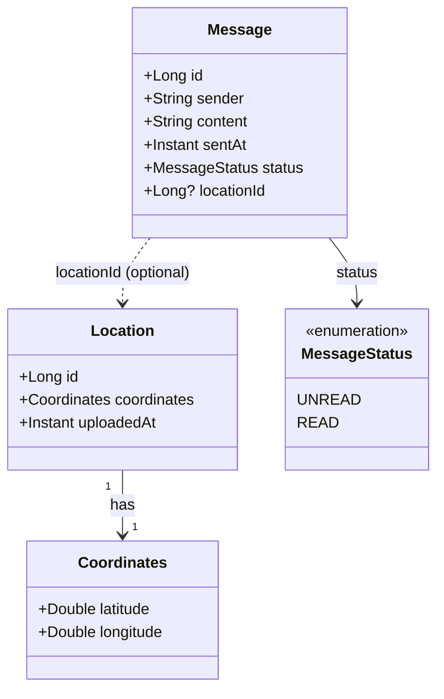
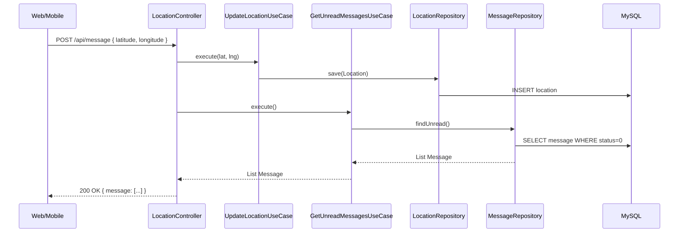
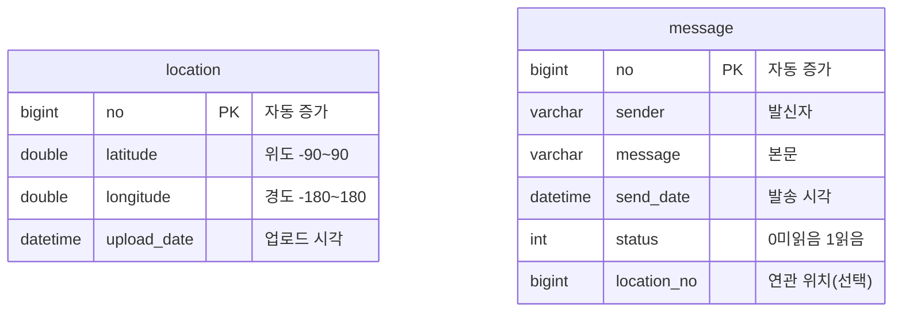

# Location Sample Project

<br/>


<br/>

---

## 1. 프로젝트 소개

위치 기반 메시지 및 위치 추적을 위한 **풀스택 샘플 프로젝트**입니다.

| 구분 | 기술 스택 | 설명 |
|------|-----------|------|
| **Backend** | Kotlin / Spring Boot | REST API, 위치·메시지 도메인, JPA/MySQL |
| **Web** | Vue 3 / Vite | 지도(카카오맵), 위치 갱신, 메시지 목록·발송 |
| **Mobile** | Expo / React Native | 위치 추적, 주기적 좌표 전송, 수신 메시지 로컬 알림 |

- **Backend** 하나로 위치·메시지 API를 제공하며, **Web**과 **Mobile**이 동일한 API를 사용합니다.
- **도메인·애플리케이션·인프라**를 분리한 **DDD + Clean Architecture**로 설계되어, 비즈니스 규칙은 도메인/유스케이스에, HTTP·DB·Expo 등은 인프라(포트 구현)에 두었습니다.
- **Mobile**은 기존 Android Java 위치 추적 앱을 **React Native + Expo**, **TypeScript**, **pnpm**으로 재구현한 구조입니다.

---

## 2. 아키텍처 구조

### 2.1 시스템 구성도

Backend 단일 API 서버에 Web·Mobile 클라이언트가 동일 API를 소비합니다.



### 2.2 Backend 레이어 (location)

패키지 베이스: `com.sleekydz86.location`

- **interfaces/web** → Controller, DTO, 예외 처리
- **application** → 유스케이스(Location, Message)
- **domain** → 엔티티(Location, Message, Coordinates), RepositoryPort
- **infrastructure/persistence** → JPA 엔티티, JpaRepository, RepositoryAdapter

의존성: `interfaces` → `application` → `domain` / `infrastructure` → `domain`



### 2.3 Frontend 레이어 (frontend-location)

- **presentation** → App.vue, hooks(useLocation, useMessages), utils
- **composition** → API 주입, 유스케이스 내보내기
- **application** → IBackendApi(포트), locationUseCases, messageUseCases
- **infrastructure** → HttpBackendApi
- **domain** → types(LocationResponse, MessageItem 등)

의존성: presentation → composition → application + infrastructure



### 2.4 Mobile 레이어 (location-mobile)

- **presentation** → HomeScreen, useLocationTracking
- **application** → 포트(ILocationService, IMessageApi, INotificationService), 유스케이스(Start/StopLocationTracking), composition(useCases)
- **infrastructure** → ExpoLocationService, MessageApiAdapter, ExpoNotificationService
- **domain** → Coordinates, Message 등

의존성: UI → 훅 → 유스케이스 → 포트 ← 인프라



---

## 3. 테이블명세서

DB는 MySQL을 사용하며, JPA `ddl-auto: update`로 테이블이 생성·갱신됩니다. 위치·메시지는 서로 FK로 묶이지 않고, API 단에서만 함께 다룹니다.

### 3.1 location

디바이스/클라이언트가 올린 위치 이력. 최근순 조회·지도 마커용.

| 컬럼명 | 데이터 타입 | NULL | 키 | 기본값 | 설명 |
|--------|-------------|------|-----|--------|------|
| no | BIGINT | N | PK, AUTO_INCREMENT | - | 일련번호 |
| latitude | DOUBLE | N | - | - | 위도 (-90 ~ 90) |
| longitude | DOUBLE | N | - | - | 경도 (-180 ~ 180) |
| upload_date | DATETIME(6) | N | - | - | 업로드 시각 (Instant) |

- 인덱스: `upload_date` DESC 방향 조회에 유리하도록 설계 권장.

### 3.2 message

발신자·본문·발송 시각·상태. 페이징·미읽음 조회용.

| 컬럼명 | 데이터 타입 | NULL | 키 | 기본값 | 설명 |
|--------|-------------|------|-----|--------|------|
| no | BIGINT | N | PK, AUTO_INCREMENT | - | 일련번호 |
| sender | VARCHAR(1000) | Y | - | - | 발신자 |
| message | VARCHAR(5000) | Y | - | - | 본문(content) |
| send_date | DATETIME(6) | N | - | - | 발송 시각 (Instant) |
| status | INT | N | - | 0 | 0=UNREAD(미읽음), 1=READ(읽음) |
| location_no | BIGINT | Y | - | NULL | 연관 위치 번호 (선택, FK 아님) |

- 인덱스: `send_date` DESC, `status` 기준 조회 패턴 고려.

---

## 4. UML

### 4.1 도메인 모델 (Backend)



### 4.2 API 연동 시퀀스 (위치 전송 + 미읽음 메시지)



### 4.3 ERD



---

## 5. 기능 및 사용 방법

### 5.1 Backend API (location)

| 기능 | HTTP | 사용 방법 |
|------|------|-----------|
| 내 위치 조회 | `GET /api/mylocation` | 최신 저장 위치 1건. 없으면 204. |
| 위치 목록 | `GET /api/locations?limit=100` | 최근 위치 목록(limit 1~500). 지도 마커용. |
| 위치 전송 + 미읽음 메시지 | `POST /api/message` | Body: `{ "latitude", "longitude" }`. 위치 저장 후 미읽음 메시지 배열 반환. |
| 메시지 목록 | `GET /api/messages?page=1&pageSize=10` | 페이징 목록. |
| 메시지 발송 | `POST /api/messages` | Body: `{ "sender", "message" }`. |
| 메시지 읽음 처리 | `POST /api/messages/read/{no}` | 해당 메시지 읽음 처리. |

**실행:** `location` 폴더에서 `./gradlew bootRun` (Windows: `gradlew.bat bootRun`). JDK 17, MySQL 필요. DB는 `application.yml` 기준 `localhost:3306/finsight`, 사용자 `finsight`/비밀번호 `root123`.

### 5.2 Web (frontend-location)

| 기능 | 사용 방법 |
|------|-----------|
| 최신 위치 불러오기 | "최신 위치 불러오기" 버튼 → `GET /api/mylocation` 후 화면에 표시. |
| 위치 갱신 | "위치 갱신" 버튼 → 브라우저 Geolocation으로 위·경도 획득 → `POST /api/message` 전송 → 미읽음 메시지 반영. |
| 지도 마커 | `GET /api/locations`로 목록 조회 후 카카오맵에 마커 표시. 마커 클릭 시 오버레이(갱신 시각, 좌표). |
| 지도 새로고침 | "지도 마커 새로고침" 버튼으로 목록 재조회. |
| 메시지 목록 | 이전/다음 버튼으로 페이징. |
| 메시지 보내기 | 작성자·내용 입력 후 전송. 성공 시 폼 초기화·첫 페이지 재조회. |

**실행:** `frontend-location`에서 `pnpm install` → `pnpm dev`. `.env`에 `VITE_API_BASE_URL`, `VITE_KAKAO_MAP_KEY` 설정(선택). 기본 포트 5173. `/api` 요청은 Vite 프록시로 `http://localhost:8080` 전달 → **백엔드를 8080에서 먼저 실행**해야 합니다.

### 5.3 Mobile (location-mobile)

| 기능 | 사용 방법 |
|------|-----------|
| 위치 추적 시작 | "위치 추적 서비스 시작" 버튼 → 위치 권한 요청 → 약 60초 간격으로 GPS 수집 → 좌표를 `POST /api/message`로 전송 → 수신 메시지를 로컬 알림으로 표시. |
| 위치 추적 종료 | "위치 추적 서비스 종료" 버튼 → 구독 해제. |
| 상태 표시 | 대기(idle), 시작 중(starting), 추적 중(active), 종료 중(stopping), 오류(error)를 화면에 반영. |

**실행:** `location-mobile`에서 `pnpm install` → `pnpm start`. `.env`에 `EXPO_PUBLIC_API_BASE_URL` 설정(에뮬레이터: Android `http://10.0.2.2:8080`, iOS `http://localhost:8080`). 상세 구조는 `docs/location-mobile/README.md` 참고.

---

## 6. 각 프로젝트 패키지 구조

### 6.1 Backend (location)

```
location/
├── src/main/kotlin/.../
│   ├── domain/
│   │   ├── location/       # Coordinates, Location, LocationRepositoryPort
│   │   └── message/       # Message, MessageStatus, MessageRepositoryPort
│   ├── application/
│   │   ├── location/       # GetCurrentLocation, GetLocations, GetLocationsWithMessages, UpdateLocation
│   │   └── message/       # GetMessagesPaginated, GetUnreadMessages, GetLatestMessagesByLocationIds, SendMessage, MarkMessageAsRead
│   ├── infrastructure/persistence/  # *JpaEntity, *JpaRepository, *RepositoryAdapter
│   ├── interfaces/web/     # LocationController, MessageController, DTO, GlobalExceptionHandler
│   └── global/             # WebConfig(CORS), JpaConfig, ApiKeyFilter, exception
└── src/main/resources/
    ├── application.yml
    └── schema.sql (optional)
```

### 6.2 Frontend (frontend-location)

```
frontend-location/src/
├── domain/           # types.ts (LocationResponse, MessageItem, MessagesPageResponse 등)
├── application/
│   ├── port/         # IBackendApi
│   └── use-cases/    # locationUseCases, messageUseCases
├── infrastructure/api/  # HttpBackendApi (fetch, VITE_API_BASE_URL)
├── composition/      # index.ts (api 주입, 유스케이스 내보내기)
├── presentation/     # hooks (useLocation, useMessages), utils (format)
├── App.vue
└── main.ts
```

### 6.3 Mobile (location-mobile)

```
location-mobile/
├── App.tsx
└── src/
    ├── domain/
    │   ├── value-objects/   # Coordinates
    │   └── entities/        # Message, Messages
    ├── application/
    │   ├── ports/           # ILocationService, IMessageApi, INotificationService
    │   ├── use-cases/       # StartLocationTracking, StopLocationTracking
    │   └── composition/     # useCases.ts (포트 구현체 주입)
    ├── infrastructure/
    │   ├── location/        # ExpoLocationService
    │   ├── http/            # MessageApiAdapter
    │   └── notifications/   # ExpoNotificationService
    └── presentation/        # useLocationTracking, HomeScreen
```

---

## 7. 설계 이유

- **Backend를 단일 API로 둔 이유:** 웹과 모바일이 같은 엔드포인트·요청/응답을 쓰면 스펙이 한 곳에서 정해지고, 도메인·검증·에러 형식을 서버에서 일원화할 수 있습니다.
- **도메인·유스케이스·인프라 분리:** 비즈니스 규칙은 도메인·유스케이스에 두고, HTTP·JPA·expo-location·알림은 인프라에만 두어 테스트·교체가 쉽도록 했습니다.
- **프론트/모바일 포트·유스케이스:** API 호출을 포트로 추상화해 구현체만 바꿀 수 있게 했고, 모바일은 위치·API·알림을 각각 포트로 두어 플랫폼 변경 시 유스케이스·화면 수정을 최소화했습니다.
- **location / message 테이블 분리:** “위치 전송 시점에 서버가 반환하는 미읽음 메시지 목록”만 필요하므로 FK 없이 독립 엔티티로 두고, 조합은 API(유스케이스)에서 처리했습니다.

---
